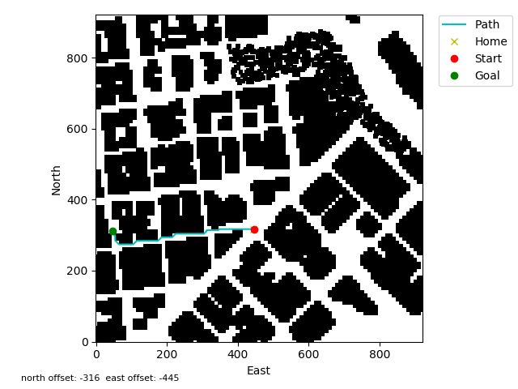

# Write up for 3D Motion Planning Project

## Explain the Starter Code
In backyard_flyer_solution.py the waypoints are manually entered and hard coded.  See method calculate_box.   

In motion_planning.py the path is planned after arming and a new state has been added for this named PLANNING.  Method path_plan does the following to plan the path.   
- Gets the global home, global position and local position
- Gets the obstacle map
- Creates a grid for the specified altitude and safety margin around obstacles  
- Defines the grid starting point and goal location
- Runs A* search to find a path
- From this path prunes points and creates a list of waypoints
- Sends the waypoints to the autopilot and transiton to takeoff


## Implementing the Path Planning Algorithm
1. Set home position    
    Extract lat0 and lon0 from colliders.csv and set as the home postition.   
    ```
    with open('colliders.csv', newline='') as f:
        reader = csv.reader(f)
        row1 = next(reader)
    
    for item in row1:
        if 'lat0' in item:
            lat0 = np.float(item.strip().split(' ')[1])
        elif 'lon0' in item:
            lon0 = np.float(item.strip().split(' ')[1])

    self.set_home_position(lon0, lat0, 0)
    ```
2. Set local position  
    Convert global position to local.   
    ```
    local_position = global_to_local(self.global_position, self.global_home)
    ```
3. Create the grid    
    ```
    data = np.loadtxt('colliders.csv', delimiter=',', dtype='Float64', skiprows=2)
    grid, north_offset, east_offset = create_grid(data, TARGET_ALTITUDE, SAFETY_DISTANCE)
    ```
3. Set local_position as grid start   
    ```
    grid_start_north = int(np.ceil(local_position[0] - north_offset))
    grid_start_east = int(np.ceil(local_position[1] - east_offset))
    grid_start = (grid_start_north, grid_start_east)
    ```
4. Set goal position   
    Convert goal global position to local and apply north and east offsets.  
    ```
    goal_lon = -122.40199327
    goal_lat = 37.79245808
    goal_global_pos = global_to_local((goal_lon, goal_lat, 0), self.global_home)
    grid_goal_north = int(np.ceil(goal_global_pos[0] - north_offset))
    grid_goal_east = int(np.ceil(goal_global_pos[1] - east_offset))
    grid_goal = (grid_goal_north, grid_goal_east)
    ```
6. Find path using A*   
    The A* algorithm is used to find the lowest cost path between two points.   
    The A* algorithm was updated to allow for diagonal motion.   
    The following actions and costs were added.   
    ```
    NORTH_EAST = (-1, 1, np.sqrt(2))
    SOUTH_EAST = (1, 1, np.sqrt(2))
    NORTH_WEST = (-1, -1, np.sqrt(2))
    SOUTH_WEST = (1, -1, np.sqrt(2))
    ```   

    And valid_actions() was updated with the following.
    ```
    if x - 1 < 0 or y + 1 > m or grid[x - 1, y + 1] == 1:
        valid_actions.remove(Action.NORTH_EAST)
    if x - 1 < 0 or y - 1 < 0 or grid[x - 1, y - 1] == 1:
        valid_actions.remove(Action.NORTH_WEST)
    if x + 1 > n or y + 1 > m or grid[x + 1, y + 1] == 1:
        valid_actions.remove(Action.SOUTH_EAST)
    if x + 1 > n or y - 1 < 0 or grid[x + 1, y - 1] == 1:
        valid_actions.remove(Action.SOUTH_WEST)
    ```

    Finally calling a_star() in motion_planning.   
    ```
    path, _ = a_star(grid, heuristic, grid_start, grid_goal)
    ````
6. Prune path points to create waypoints     
    The path was pruned by removing collinear points.  By checking if the determinat of the matrix of 3 consecutive points is below some very small epsilon value they must be on a straight line so the middle point can be removed.   
    ```
    def collinearity_prune(path, epsilon=1e-5):
        pruned_path = [i for i in path]

        i = 0
        while i < len(pruned_path) - 2:
            p1 = point(pruned_path[i])
            p2 = point(pruned_path[i+1])
            p3 = point(pruned_path[i+2])

            mat = np.vstack((p1, p2, p3))
            if(abs(np.linalg.det(mat)) < epsilon):
                pruned_path.remove(pruned_path[i+1]) 
            else:
                i += 1

        return pruned_path
    ```  
7. Send waypoints to autopilot and take off   

## Plot of flight path  
